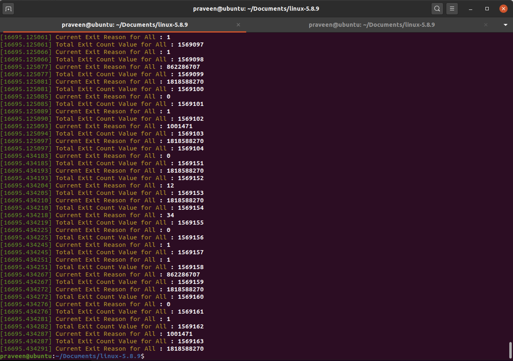
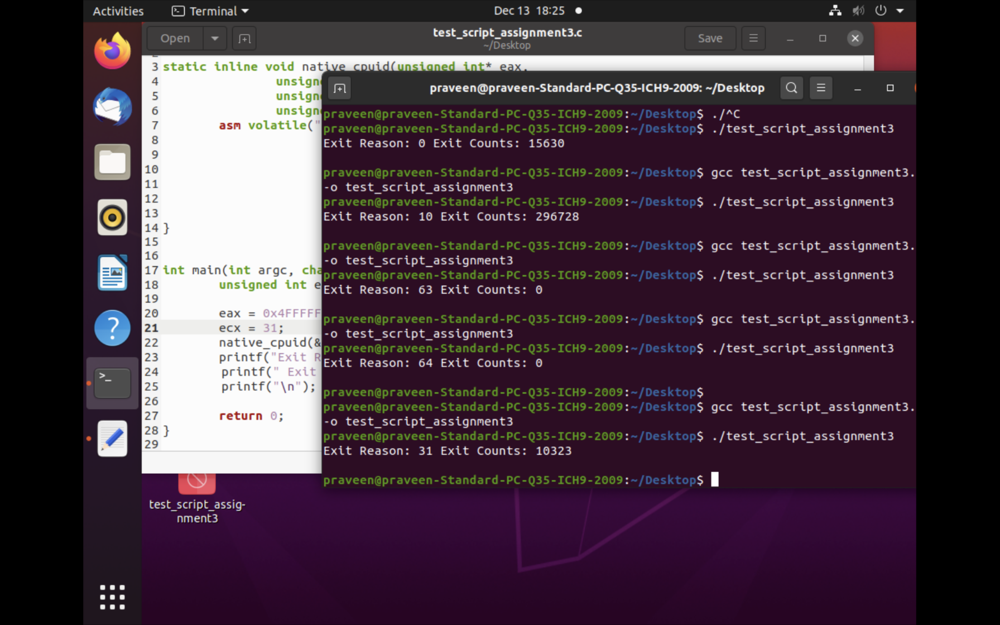

# Assignment 3: Instrumentation via hypercall
Assignment3 CMPE283

Student Contribution

Yadnyshree Savant
=================
Question: Modify the kernel code with the assignment functionality:
Determine where to place the measurement code (for exit counts) 
Create new CPUID leaf 0x4FFFFFFE
Report back information as per the requirement

Answer: Created a new leaf eax == 0x4FFFFFFE with 3 if conditions
	 1. For KVM exit types not enabled 
	 		reference (https://github.com/nayak-codebase/assignment2/blob/master/linux-5.8.9/arch/x86/include/uapi/asm/vmx.h)
	 2. For SDM exit types not enabled 
	 		reference APPENDIX C - Vol 3D C1 of SDM.
	 3. For KVM/SDM exit types enabled	
	 
	 For each of the above conditions exit reason and exit count is printed for dmesg.

Praveen Nayak
=============
Question: Create a user-mode program that performs various CPUID instructions required to test your assignment
Pro tip: This can be achieved on ubuntu by installing the ‘cpuid’ package Run this user mode program in the inner VM
There is no need to insmod anything like assignment 1 did
Verify proper output

Answer: A function was added to increment the counter for the exit reason.
 Function Name - add_exit_time_per_rsn where count of exits are loaded for a given ecx value.
 Created a Test Script to query the leaf 0x4FFFFFFE and obtain the values of exit reason and exit count and compare with dmesg values.
 Reference to query: http://dj-lee.com/2017/09/21/cpuid/

Common Tasks
=============
1.For the assignment the kernel code files changed are as below. These need to be done on the host machine

	~/linux/arch/x86/kvm/cpuid.c
	~/linux/arch/x86/kvm/vmx.c

2.Post changes run the below commands

	sudo rmmod kvm_intel
	sudo rmmod kvm
	sudo make SUBDIRS=arch/x86/kvm/
	sudo insmod arch/x86/kvm/kvm.ko
	sudo insmod arch/x86/kvm/kvm-intel.ko
 
3.Start the guest VM using virt-manager command

4.Run a program which queries cpuid leaf 0x4FFFFFFE and input ecx value

3.Question: Comment on the frequency of exits – does the number of exits increase at a stable rate? Or are there more exits performed during certain VM operations? Approximately how many exits does a full VM boot entail?

Answer: Exits are increasing but not at a stable rate after performing the operations in VM such as opening and closing of the folder ,files ,radio, web browser.
Count of exits printed by dmesg fired at every 20 seconds including performing VM operations.

1709895
1710639
1717136

On a full VM boot - 1569163 exit count

4. Question: Of the exit types defined in the SDM, which are the most frequent? Least?
Answer: Most frequent exit types that were observed are 0 and 10 and least were 63 and 64.

