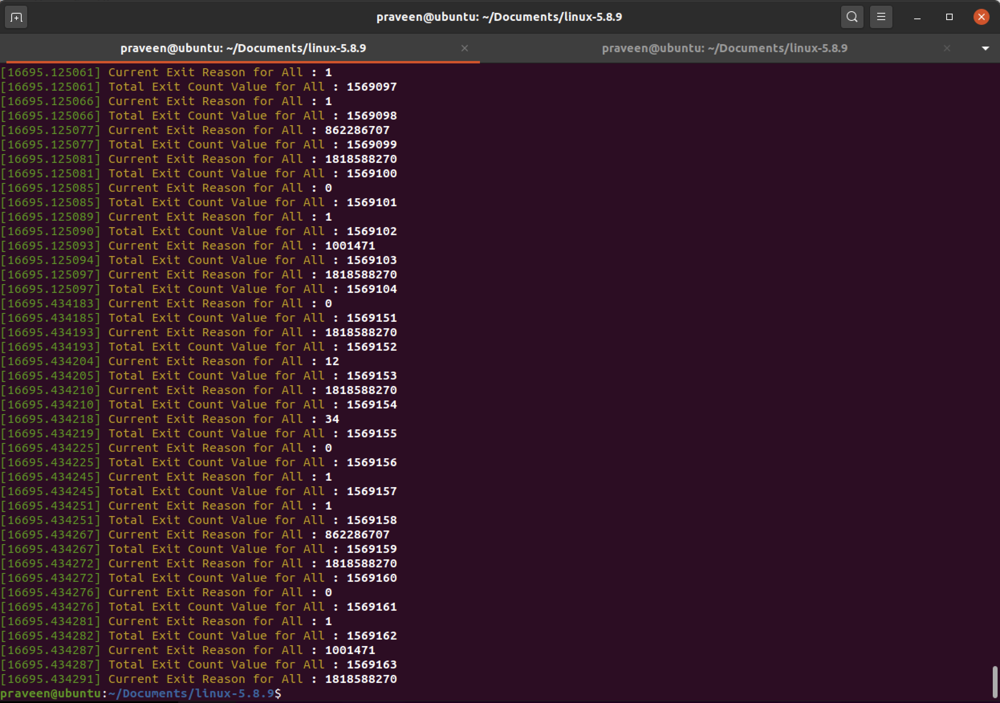

# Assignment 4: Nested Paging vs. Shadow Paging
Assignment4 CMPE283

Student Contribution

Yadnyshree Savant
=================
> **Question :** 

1. For each member in your team, provide 1 paragraph detailing what parts of the lab that member implemented / researched. (You may skip this question if you are doing the lab by yourself).

> **Answer :** 

Executed the command from the linux kernel with ept -0.  

Took the readings from dmesg.

Praveen Nayak
=============
> **Answer :** 

Discussed with Yadnyshree and compare the values from the output of dmesg with ept-0 and ept-1(default)
We were able to infer that as expected , ept-0 exit count increased.

> **Question :** 

2. Include a sample of your print of exit count output from dmesg from “with ept” and “without ept”.

> **Answer :** 

> **with ept=0 count for exit reason 0,10,31**

> **with ept=1 count for exit reason 0,10,31**

> **Question :** 

3. What did you learn from the count of exits? Was the count what you expected? If not, why not?

> **Answer :** 

	Since with ept-0 shadow paging was enabled the count of exits increased as described in the lecture 7.
  
Total Number of exits with ept-0 - 1761485
Total Number of exits with ept-1 - 1569163

> **Total Number of exits with ept-0 - 1761485** 

> **Total Number of exits with ept-1 - 1569163** 

> **Question :** 

4. What changed between the two runs (ept vs no-ept)?

> **Answer :** 
With no-ept (ept=1) nested paging is enabled and hence less number of exits.
With ept (ept=0) shadow paging gets enabled and hence more number of exits.
MOV to and from CR3 causes an exit and we have to enable exit on TLB flush as well in shadow paging and hence more exits than nested paging.

