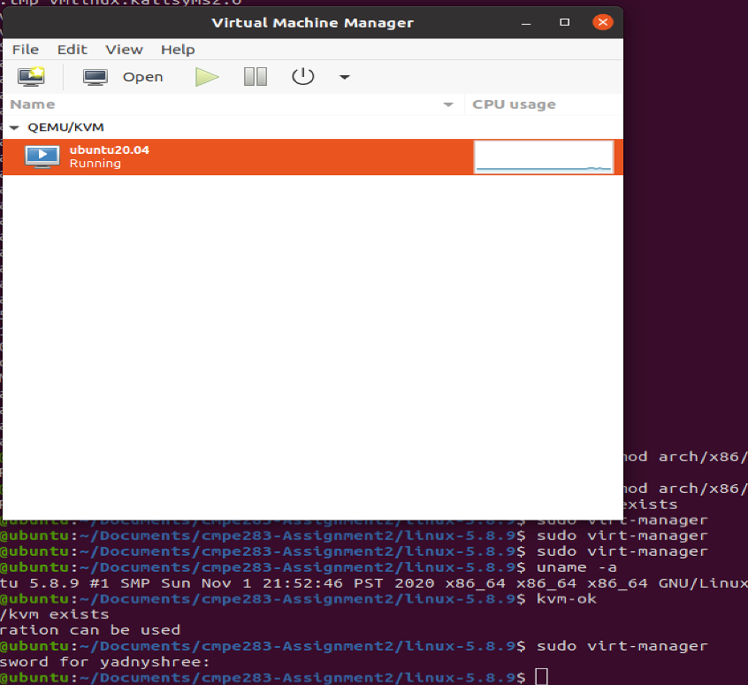

# assignment2 - Modifying instruction behavior in KVM
assignment2 CMPE283

Student Contribution

Yadnyshree Savant
=================
  Individually identified the files which needed the modification for the assignment.
  As there were two files which needed modification vmx.c and cpuid.c, I picked up vmx.c to make the changes.
  Following function (vmx_handle_exit(struct kvm_vcpu *vcpu, fastpath_t exit_fastpath)) was modified to return the total exit count atomic variables.
  
Praveen Nayak
=============
  Modifications to the function (kvm_emulate_cpuid) in the file cpuid.c was performed.
  Printed the total exits in EAX ,upper 32bits EBX and lowerbit 32bits ECX when eax==0x4FFFFFFF condition is true.

Common tasks performed
======================
Installation steps were performed on both our individual machines.
BusyBox black screen with initramfs prompt issue was researched and came to conclusion to use of a lower version of linux to resolve the issue.
Test script to check the exits were executed on both our machines.

  

We cloned the git repository https://github.com/torvalds/linux, after compiling this kernel code. 

The Linux 5.9.0 version was installed with the below error.

We did a lot of research to resolve this error.
Here we took an alternate path. Below are the steps:

1.From the website kernel.org we downloaded the Linux version 5.8.9 using the command
wget https://cdn.kernel.org/pub/linux/kernel/v5.x/linux-5.8.9.tar.xz

2.Verify Linux (https://www.kernel.org/category/signatures.html)
gpg --verify linux-5.6.9.tar.sign

3.Get the public key
gpg --recv-keys 79BE3E4300411886

Verify keys
gpg --verify linux-5.6.9.tar.sign

4.Untar the file 
 	tar xvf linux-5.6.9.tar

6.Configure the Linux kernel module features

cp -v /boot/config-$(uname -r) .config

7.Compile the kernel module
make -j $(nproc)

8.Install the kernel modules
sudo make modules_install

9.Install Linux kernel
sudo make install

10.Update the grub config
sudo update-initramfs -c -k 5.8.9
     	sudo update-grub

11.Reboot

12.Verify the linux version using command: 
uname -a

  Steps followed for installing KVM on Ubuntu 20.0.4

1.First check if virtualization is supported
	egrep -c '(vmx|svm)' /proc/cpuinfo

2.Check if system supports KVM virtualization
	sudo kvm-ok

output :

3.Referred the below link to Install KVM and virt manager on ubuntu 
https://help.ubuntu.com/community/KVM/VirtManager

4.Create a Virtual Machine in Ubuntu
a.Launch virt manager
sudo virt-manager

b.Click the monitor icon, Select local install media ,Choose the iso image from local, Choose memory and number of CPU’s

For the assignment the kernel code files changed are as below. These need to be done on the host machine

	~/linux/arch/x86/kvm/cpuid.c
	~/linux/arch/x86/kvm/vmx.c

1.Post the changes run the below commands

sudo rmmod kvm_intel
sudo rmmod kvm
sudo make SUBDIRS=arch/x86/kvm/
sudo insmod arch/x86/kvm/kvm.ko
sudo insmod arch/x86/kvm/kvm-intel.ko

2.Start the guest VM using virt-manager command
3.Create a shell script file as below

!#/bin/bash
cpuid="0x4FFFFFFF" output=$(cpuid -l $cpuid -1)
eax=$(echo $output | grep 0x4fffffff | awk '{print toupper($4)}' | cut -c7-14)
ebx=$(echo $output | grep 0x4fffffff | awk '{print toupper($5)}' | cut -c7-14)
ecx=$(echo $output | grep 0x4fffffff | awk '{print toupper($6)}' | cut -c7-14)
exits=$(echo "ibase=16; $eax" | bc) cycles=$(echo "ibase=16; $ebx$ecx" | bc)
echo "CPUID($cpuid), exits=$exits, cycles spent in exit=$cycles"

4.Execute this file 
 ./assignment
 
 Output:
Contains the number of exits and number of cpu cycles

Dmesg on host VM
Return the total number of exits (all types) in %eax
Return the high 32 bits of the total time spent processing all exits in %ebx
Return the low 32 bits of the total time spent processing all exits in %ecx

Comment on the frequency of exits – does the number of exits increase at a stable rate? Or are there more exits performed during certain VM operations? Approximately how many exits does a full VM boot entail?

VM exits increases at a stable rate if vm operations are not performed and only by using the sleep command.
The value of exits increase by 270 every 10 secs.

The value of exits increase by 500 every 60 secs.

More exits were noticed when vm operations such as opening a folder , opening a file , playing a radio , the exits were above 4000 after the vm operations were performed.

Full vm exits were identified by executing the shell script immediately after logging in to the inner vm shell.The total exits recorded was 747089.

